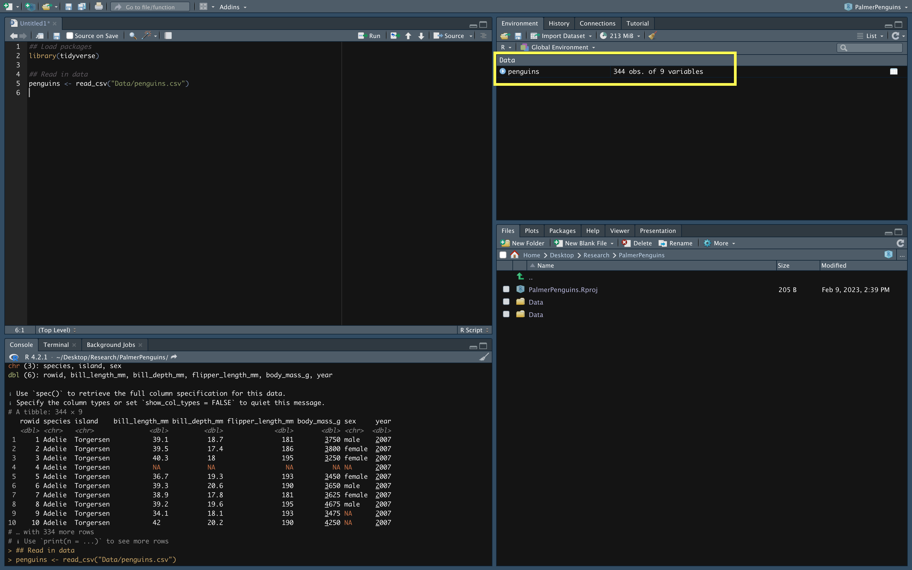

<!-- Add JavaScript code for making the exercise code larger -->

```{=html}
<script language="JavaScript" src="js/exercise-font-size.js"></script>
```
```{r setup, include=FALSE}
# packages
library(png)
library(tidyverse)
library(rphylopic)
library(sortable)
library(exams)
library(exams2learnr)
#remotes::install_github("rstudio/learnr")
library(learnr)
#remotes::install_github("rstudio/gradethis")
library(gradethis)
gradethis_setup()
#devtools::install_github("rundel/learnrhash")
library(learnrhash)


# tutorial options
tutorial_options(
  # code running in exercise times out after 30 seconds
  exercise.timelimit = 30, 
  # use gradethis for checking
  exercise.checker = gradethis::grade_learnr
  )

# make Palmer Penguins data frame globally available

penguins <- read_csv("Data/penguins.csv")

penguins_nafree <- drop_na(penguins)

# hide non-exercise code chunks
knitr::opts_chunk$set(echo = FALSE, message = FALSE, warning = FALSE)


knitr::clean_cache()

# install phylopic function
th <- theme_void() 
theme_set(th)

phylopic <- function(img, alpha = 1, x = NULL, y = NULL, ysize = NULL, 
  color = NULL) {
  require(ggplot2)
  mat <- rphylopic:::recolor_phylopic(img, alpha, color)
  if (!is.null(x) && !is.null(y) && !is.null(ysize)) {
    aspratio <- nrow(mat) / ncol(mat) ## get aspect ratio of original image
    ymin <- y - ysize / 2
    ymax <- y + ysize / 2
    xmin <- x - ysize / aspratio / 2
    xmax <- x + ysize / aspratio / 2
  } else {
    ymin <- -Inf ## fill whole plot...
    ymax <- Inf
    xmin <- -Inf
    xmax <- Inf
  }
  imgGrob <- grid::rasterGrob(mat)
  return(
    annotation_custom(xmin = xmin, ymin = ymin, xmax = xmax, 
      ymax = ymax, imgGrob)
  )
}

kiwi <- readPNG("www/img/kiwi.png")
kea <- readPNG("www/img/kea.png")


```

## **Nau mai, haere mai**

This tutorial will provide you with in depth explanations and interactive exercises to help you develop and practice your `R` programming skills!

### **Learning goals**

The tutorial starts off with a few simple exercises to get you familiar with `R` before taking you through the typical work flow when conducting data analysis. The tutorial touches upon the common errors you will likely come across in this process. The hope is that after using this application you will have begun to develop an effective coding etiquette that minimises such errors, but also be able to identify and fix any errors that remain.

In order to get the most out of this tutorial, it is recommended that you follow along the material in `RStudio`. 

### **Reference material**

This application is designed to be used alongside [the BIOSCI220 course guide](https://stats-uoa.github.io/BIOSCI220/) so please refer back to the guide for a more in-depth look into each of the topics.

### **Further help**

If you have any questions regarding the material in this tutorial, please post them on Piazza (link)!

------------------------------------------------------------------------

The app was developed by Daniel Heslop as part of a 2022/3 summer research project.

## **The Palmer Penguins Dataset**

<br>

```{r Penguins, fig.margin = TRUE, echo = FALSE, fig.width=5, out.width = "100%", out.height= "100%"}

```

<br>

This dataset includes 344 individual penguins and includes information on their specific species, sex, the island on which they were recorded as well as when the observation was made. It also contains various body measurements, including: bill length and depth, flipper length and body mass. These variables are defined as follows:

| Variable     | Description                                                                                                                       |
|:-------------------------|:---------------------------------------------|
| `species`     | The species of the penguin (Chinstrap, Adélie, or Gentoo)                                                                                                               |
| `island`       | The island name (Dream, Torgersen, or Biscoe) in the Palmer Archipelago (Antarctica)                                                                                                             |
| `bill_length_mm`      | Bill length (mm) |
| `flipper_length_mm`      | Flipper length (mm)                                                                                       |
| `body_mass_g`      | Body mass (g)                                                 |
| `sex`         | Sex of the penguin (male or female)                                           |
| `year`     | Year the observation was made                                                                        |

The dataset is available as a CSV file [here](https://gist.github.com/slopp/ce3b90b9168f2f921784de84fa445651). 

## **Getting familiar with R**

For many of you this may be the first time you have seen `R` code, let alone actually coded in `R`. Before we jump into using the Palmer Penguins dataset, lets get to know `R` a little first! The following simple exercises are designed to make you familiar with its basic structure and functionality as well as to introduce you to coding best practice when using `R`.

------------------------------------------------------------------------

### **Assigning objects** | Section 1.3.4

Section 1.3.4 of the course book outlines how to create objects in `R`. This can be done using the assignment operator (`<-`), so called because it assigns the stuff on the right of the arrow to the object on the left.

1. Alter the following code to assign the group of New Zealand native birds to an object called `native_birds`.

```{r simpleex1, exercise = TRUE}
c("Kiwi", "Kea", "Hihi", "Hoiho", "Kākāpō", "Whio")
```

```{r simpleex1-solution}
native_birds <- c("Kiwi", "Kea", "Hihi", "Hoiho", "Kākāpō", "Whio")
```

```{r simpleex1-check}
grade_this_code()
```

<br>

<div class="tip">
**Tip: Assignment operator shortcut** 

Instead of manually typing out the assignment operator (`<-`) every time, we can use a shortcut!

For Windows, use `Alt` + `-`. For Mac, use `Option` + `-`. 

Give it a go in Question 1.
</div>

<br>

Now the object `native_birds` has been created and saved to `R`'s memory. We can now refer back to it, use it, change it, or view it. To view it we type out the object name and run it.

Try running the following code to see the contents of the object `native_birds`. 

```{r simpleex1_1-setup}
native_birds <- c("Kiwi", "Kea", "Hihi", "Hoiho", "Kākāpō", "Whio")
```

```{r simpleex1_1, exercise = TRUE}
native_birds
```

<br>

To change it, we can simply change the assignment to the right of the arrow while keeping the object name the same.

2. Overwrite the previous list of native birds with a new one that adds 'Ruru' to the list. [i.e. `c("Kiwi", "Kea", "Hihi", "Hoiho", "Kākāpō", "Whio", "Ruru")`]. 

```{r simpleex2, exercise = TRUE}
native_birds <- c("Kiwi", "Kea", "Hihi", "Hoiho", "Kākāpō", "Whio")
```

```{r simpleex2-solution}
native_birds <- c("Kiwi", "Kea", "Hihi", "Hoiho", "Kākāpō", "Whio", "Ruru")
```

```{r simpleex2-check}
grade_this_code()
```

<br> 

Now run the following code to see the updated `native_birds` object.

```{r simpleex2_1-setup}
native_birds <- c("Kiwi", "Kea", "Hihi", "Hoiho", "Kākāpō", "Whio", "Ruru")
```

```{r simpleex2_1, exercise = TRUE}
native_birds
```

<br>

A common error when calling up objects in `R` is misspelling the object name. These names are case-sensitive and, therefore, must be written exactly as defined. 

3.  In the following code chunk our object has been written incorrectly. Try running the code to see what happens. Then, correct the mistake and submit.

```{r simpleex3-setup}
native_birds <- c("Kiwi", "Kea", "Hihi", "Hoiho", "Kākāpō", "Whio", "Ruru")
```

```{r simpleex3, exercise = TRUE}
Native_birds
```

```{r simpleex3-solution}
native_birds
```

```{r simpleex3-check}
grade_this_code()
```

<br>

In this case, our object is a collection of characters (words). However, objects can be assigned other forms of information, including numbers, or even entire datasets (more on this later)!

4. In the code chunk below, assign the group of numbers `c(1, 4, 25, 50, 87, 102)` to an object called `numbers`. Hint: Try using the assignment operator shortcut mentioned above. 

```{r simpleex4, exercise = TRUE}

```

```{r simpleex4-solution}
numbers <- c(1, 4, 25, 50, 87, 102)
```

```{r simpleex4-check}
grade_this_code()
```


------------------------------------------------------------------------

<br>

### **Functions** | Section 1.3.5

Functions perform tasks in `R`. A function takes inputs that are assigned to one of its arguments, and using these it creates an output that is returned when you run it. You can easily spot a function as they have a name followed by rounded brackets, for example,  `ggplot()`, `mean()` and `plot()`. You can think of arguments as options that you set for the function by writing them within the brackets.

5. Modify the argument in the following code to plot a `kiwi`.

```{r simpleex5, exercise = TRUE, exercise.eval = TRUE}
#ggplot() +
  #phylopic(kea)
```

```{r simpleex5-solution}
#ggplot() + phylopic(kiwi)
```

```{r simpleex5-check}
#grade_this_code()
```

<br>

6. Modify the argument in the following code to plot a [forestgreen]{style="color:forestgreen;"} `kiwi`.

```{r simpleex6, exercise = TRUE, exercise.eval = TRUE}
#ggplot() +
  #phylopic(kiwi, col = "grey")
```

```{r simpleex6-solution}
#ggplot() + 
  #phylopic(kiwi, col = "forestgreen")
```

```{r simpleex6-check}
#grade_this_code()
```

<br>

<div class="tip">
**Tip: More colour options** 

A quick Google search of R colours returns a vast range of different colour options and palettes that you can use in `R`.

One list of colours that work in `R` (though not exhaustive) can be found [here](https://www.stat.auckland.ac.nz/~ihaka/downloads/R-colours-a4.pdf).
</div>

<br>

Next, let's take the simple function `mean()`, which (no surprises) calculates the mean (or average) of a set of values. This set of values act as the input to the function. 

As mentioned, a function requires at least one input. If no arguments are given, then you will get an error message. 

In the code chunk below, type the `mean()` function. Run it as is and see what happens.

```{r simpleex7_1, exercise = TRUE}

```

Our error message states that we are missing argument "x", and that `R` has no default setting for this argument. The `mean()` function has an argument called 'x' which requires an object or variable as an input. This input is what we want to calculate a mean for.

<br>

<div class="tip">
**Tip: Finding out a functions' arguments** 

RStudio comes with a very detailed and useful help section. To learn about the arguments for a particular function just type the function name with a question mark in front within RStudio's Console and hit enter. 

For example, typing `?mean` in the Console and hitting enter will show us a page with everything we need to know about the `mean()` function, including it's arguments. 

Open up RStudio and try giving it a go. 
</div>

<br>

7. Recall that in Question 4 we assigned a set of values to an object called `numbers`. In the following code chunk, input the object `numbers` within the brackets of the `mean` function. Run the code and now see what happens.

```{r simpleex7-setup}
numbers <- c(1, 4, 7, 12, 32, 104)
```

```{r simpleex7, exercise = TRUE}
mean(x = )
```

```{r simpleex7-solution}
mean(x = numbers)
```

```{r simpleex7-check}
grade_this_code()
```

------------------------------------------------------------------------

<br>

### **Arithmetic**

As we have just seen, one of the basic, yet very useful, abilities of `R` is it's ability to do mathematical calculations. The following questions highlight a few basic mathematical operations that `R` supports. 

8.. The following code computes 6 x 5. Alter the code to calculate 25 + 7:

```{r simpleex8, exercise = TRUE}
6*5
```

```{r simpleex8-check}
grade_result(
  pass_if(~identical(.result, 25+7))
)
```

<br>

9. To calculate the natural log in `R` we use the `log()` function. Alter the code below to calculate the natural log of 10. 

```{r simpleex9, exercise = TRUE}
log()
```

```{r simpleex9-check}
grade_result(
  pass_if(~identical(.result, log(10)))
)
```

<br>

We can also apply mathematical operations to sets of multiple values.

10. Try inputting our object `numbers` into the `log()` function below.

```{r simpleex10-setup}
numbers <- c(1, 4, 7, 12, 32, 104)
```

```{r simpleex10, exercise = TRUE}
log()
```

```{r simpleex10-check}
grade_result(
  pass_if(~identical(.result, log(numbers)))
)
```

<br>

11. Subtract 10 from our `numbers` object. 

```{r simpleex11-setup}
numbers <- c(1, 4, 7, 12, 32, 104)
```

```{r simpleex11, exercise = TRUE}

```

```{r simpleex11-solution}
numbers - 10
```

```{r simpleex11-check}
grade_result(
  pass_if(~identical(.result, numbers-10))
)
```


------------------------------------------------------------------------

<br>

### **Writing comments** | Section 1.3.2

Comments are notes to yourself or to others reading your code. They have no effect on the code itself, rather they help the reader interpret the code. To write a comment, precede any note you write with #.

It is often good practice to organise your code with in-code comments. This way, it is always easy to find specific lines of code in future if need be. 

In the code chunk below, write the comment `## Import dataset` in a line above where it says `read_csv()`.

**_Note: We will learn more about importing datasets into `R` very soon!_**


```{r simpleex10_2-setup}
library(tidyverse)
```

```{r simpleex10_2, exercise = TRUE}

read_csv("Data/penguins.csv")
```

------------------------------------------------------------------------

### **Errors!** | Section 1.3.7

<div class="infobox">
**Information**

This tutorial will highlight the various types of errors you are likely to encounter along your `R` journey. Unfortunately errors are inevitable, so the best way to get a handle on them is to encounter them and practice solving them. Trust me when I say, putting in the time to practice solving errors now, will save you A LOT of time and frustration in future. 

Over the course of this tutorial we will see various ways of solving errors. These include:

 * Reading the error message in the `R` Console,
 * Searching or asking questions on [Stack Overflow](https://stackoverflow.com) or [RStudio Community](https://community.rstudio.com),
 * Referencing the help section in `R`,
 * A simple Google search.
 
</div>

------------------------------------------------------------------------

## **Typical first steps to an `R` workflow**


------------------------------------------------------------------------

### **Setting up a working directory** | Section 1.3.8 & Section 1.5.1

<div class="tip">
**Tip:** 

From this point on, we recommend opening up RStudio and giving the tutorial content a go over there as well. 
</div>

<br>

Before starting a new project, it is often good practice to set up a specific working directory on your computer where you can save your work along with any other files related to your project. To do this we can do the following:

First, create a specific folder on your computer for this project. Then, in the top right hand corner of RStudio click **Projects** > **New Project** > **New Directory** > **New Project** > **Browse** > _Choose the specific folder you have set up for this project_ > _Give the project directory a name_ > **Create Project**

Once completed, you should be able to look into the project folder you created on your computer and see a file titled _YourProjectDirectoryName.Rproj_ (try giving your directory a name relevant to your project). 

<br>

```{r Directory, fig.margin = TRUE, echo = FALSE, fig.width=5, out.width = "60%", out.height= "60%", fig.align='center'}

```

<br>

Also, if you select the _Projects_ tab in the top right hand corner of RStudio, you should see your new project listed there as well. If you have multiple projects, you can switch between them here. 


------------------------------------------------------------------------

### **Installing packages** | Section 1.3.6

As mentioned in section 1.3.6 of the course book, an `R` package is simply a collection of functions. In a typical `R` workflow, one of the first things you do is to load any relevant `R` packages onto your RStudio session. 

`R` already comes with many useful packages, and many of these you will be sure to use regularly (e.g. [`mean()`](https://www.rdocumentation.org/packages/base/versions/3.6.2/topics/mean), [`c()`](https://www.rdocumentation.org/packages/base/versions/3.6.2/topics/c), [`sample()`](https://www.rdocumentation.org/packages/base/versions/3.6.2/topics/sample)). However, often we wish to do more than what base `R` offers. To do this we need to access all the other amazing packages that are out there in the `R`verse.

If we are loading an `R` package for the first time, we first need to install it onto our computer. We do this using: 

`install.packages('the.package.name')`

Once the package has been installed, we then need to load the package into RStudio for it to work in our current session. We do this using:

`library(the.package.name)`

One error you may encounter is `R` not recognising the package you are trying to load. There could be a number of reasons for this. It may be that you haven't spelled the package name quite right. A quick Google search of the package can help solve this. Otherwise, another common cause is that you are trying to load a package that hasn't yet been installed onto your computer. Try loading the following package called `Biostatistics` and see what happens:

```{r installex0, exercise = TRUE}

library(Biostatistics)

```
<br>

```{r installex1, echo=FALSE}
question("1. To resolve this error, what code should we first run?",
  answer("`install('Biostatistics')`"),
  answer("`install.packages(Biostatistics)`", message = "When installing a package you need to include parentheses around the package name"),
  answer(" `install.packages('Biostatistics')`", correct = TRUE),
  answer("`download('Biostatistics')`"),
  allow_retry = TRUE
)
```


------------------------------------------------------------------------


### **Tidyverse** | Section 1.4

Throughout this tutorial, we will be using something called `tidyverse`. This is a collection of `R` packages that all share underlying design philosophy, coding grammar, and data structures. They are specifically designed to make data wrangling, manipulation, visualisation, and analysis simpler. 

You can install and load the individual `tidyverse` packages as you would any package in `R`. To install all of the `tidyverse` packages in one go we write:

`install.packages("tidyverse")`

2. In the code chunk below, try installing `tidyverse`.

```{r installex2-setup, message=FALSE}
r = getOption("repos")
r["CRAN"] = "http://cran.us.r-project.org"
options(repos = r)
```

```{r installex2, exercise = TRUE, echo=FALSE, message=FALSE}


```

```{r installex2-solution}
install.packages("tidyverse")
```

```{r installex2-check}
grade_this_code()
```

<br>

Once we have installed the packages we want, we can go ahead and load these packages. We do this by _replacing_ `install.packages("the.package.name")` with `library(the.package.name)`. 

3. Replace the following code with new code that will load `tidyverse` onto our working session. **Hint: Unlike when installing a package, when loading a package we don't include parentheses.**


```{r installex3-setup}
r = getOption("repos")
r["CRAN"] = "http://cran.us.r-project.org"
options(repos = r)
install.packages("tidyverse")
```

```{r installex3, exercise = TRUE}
install.packages("tidyverse")
```

```{r installex3-solution}
library(tidyverse)
```

```{r installex3-check}
grade_this_code()
```

<br>

As we have learned, it is good practice to organise our code with comments. 


```{r installex4, echo=FALSE}
question("4. Which two of the following represent a comment that could be written above the lines of code loading the packages?",
  answer("`!! Load packages`"),
  answer("`** Load packages`", correct = F, message = "Do you remember what symbol comments begin with?"),
  answer(" `# Load packages`", correct = TRUE, message = "Comments always begin with #"),
  answer("`## Load packages`", correct = TRUE),
  allow_retry = TRUE
)
```

------------------------------------------------------------------------

### **Read in the data** | Section 1.4.1

For the rest of the tutorial we will be using the Palmer Penguins dataset outlined earlier. Before we can get started on any kind of analysis, however, we need to download and read the `penguins.csv` file into our working session. If you are following this tutorial in RStudio, you can download the file from [this link](https://gist.github.com/slopp/ce3b90b9168f2f921784de84fa445651) (click the `Download ZIP` button to download). For reasons we will soon see, once downloaded it is advised to place the file in the folder containing your working directory for this project. 

Section 1.4.1 of the coursebook covers one of the ways we can import a `.csv` file into `RStudio`. 

```{r readinex1, echo=FALSE}
correct_readin <- c(
  "Click `Import Dataset`",
  "Click `From Text (readr)`",
  "Click `Browse`",
  "Choose your file",
  "Click `Import`"
)

question_rank(
  "5. Place the following actions you would take when importing a dataset in the correct order",
  answer(correct_readin, correct = TRUE),
  answer(rev(correct_readin), correct = FALSE,
         message = ""
  ),
  allow_retry = TRUE
)

```

<br>

One downside to this method is that if we wanted to save our code and close RStudio for any reason, we would have to re-import the dataset manually each time we re-opened RStudio. Sometimes you will have to work on a project over many days and it's often nice to close RStudio at the end of each day. This being said, it's obvious that manually importing the dataset at the start of each day would get tedious! 

An alternative way of reading in the data that would solve this issue would be to use the `readr` package (from the `tidyverse` collection). Within the `readr` package, we can use a function called `read_csv()`. For example:

`read_csv("your/specific/path/to/the/penguins.csv")`

When using this method, it's necessary that you tell the function exactly where to find the dataset. If you don't specify the exact path, you will get an error. It is also necessary for your downloaded data file to be in the same folder as your working directory. So essentially, the path you put into the `read_csv()` function should start in your working directory and lead to the file.

Try running the following code and see what happens:

```{r readinex2-setup}
library(tidyverse)
```

```{r readinex2, exercise = TRUE}
## Read in data
read_csv("penguins.csv")

```

<br>

The resulting error message is caused because `R` can not find a file called `penguins.csv` in my working directory folder (ignore the specific file path in this error message). In fact, I have put my dataset in a sub-folder called `Data`. I need to tell the function that if it is to find the file. 

Try running the updated code:

```{r readinex3-setup}
library(tidyverse)
```

```{r readinex3, exercise = TRUE}
## Read in data
read_csv("Data/penguins.csv")

```

<br>

Essentially, the `read_csv()` function has automatically begun its search in the folder containing my working directory. I have then directed it to the `Data` sub-folder and finally to my data file `penguins.csv`.

<br>

```{r directory2, fig.margin = TRUE, echo = FALSE, fig.width=5, out.width = "60%", out.height= "60%", fig.align='center'}

```

```{r directory3, fig.margin = TRUE, echo = FALSE, fig.width=5, out.width = "60%", out.height= "60%", fig.align='center'}

```

<br>

Try importing the Palmer Penguins dataset into `R` yourself! 

If you have used `readr` to import the dataset, you will also need to assign the dataset to an object. 

6. Assign the imported dataset to an object called `penguins`.

```{r readinex4-setup}
library(tidyverse)
```

```{r readinex4, exercise = TRUE}
## Read in data
read_csv("Data/penguins.csv")

```

```{r readinex4-solution}

penguins <- read_csv("Data/penguins.csv")

```

```{r readinex4-check}
grade_this_code()
```

<br>

Regardless of which method you used to import the data, you should now notice that an object called `penguins` has appeared in the _Environment_ pane under a title called _Data_. If we want to view the dataset in future, we can click on `penguins` in this location. 

<br>

```{r RStudio, fig.margin = TRUE, echo = FALSE, fig.width=5, out.width = "90%", out.height= "90%", fig.align='center'}

```


<br>


------------------------------------------------------------------------

### **Exploratory data analysis** | Section 1.4

Once you have imported your data into `R`, the first thing you should **always** do is inspect the data. 

As mentioned, one way of doing this is by clicking on the `penguins` object in the _Environment_ pane. Otherwise, if we just want to quickly view the variable names and first 10 rows of our dataset, we can simply type `penguins` in RStudio's _Console_ or in our code chunk and hit enter. 

7. In the code chunk below, type `penguins`. Then run the code and see what happens.


```{r EDAex1, exercise = TRUE}

```

```{r EDAex1-solution}
penguins
```

```{r EDAex1-check}
grade_this_code()
```

<br>

<div class="infobox">
**Information: Data types**

From question 7, you may be wondering what `<dbl>` and `<chr>` below the variable names represent. `R` accepts various different types of data. These abbreviations are simply referring to what data type the variable is. 

For more information about data types, see section 1.3.3 in the coursebook. 
 
</div>

<br>

We view our data at the beginning of our analysis as it allows us to get a general sense of the data we are working with. From question 7 above, we can immediately see the variable names at the top of each column as well as the type of data each variable is comprised of. We can also see how large the dataset is and if the data is tidy or not (see section 2.3 of the coursebook for a definition of tidy data). If it isn't tidy, we may have to do some work on the data before we can begin our analysis. 

One thing you may have noticed is that our Palmer Penguins data contains `NA` values. These indicate missing data and represent another reason why its important to inspect our dataset. If ignored, `NA` values could pose problems for your analysis, so it's good practice to see if you can find any in your dataset.

To get a clearer idea of the extent of `NA`'s in our data, we are going to use a function called `is.na()` (this will also introduce you to logical data values or `lgl`). 

8. Type our dataset object into the following function.

```{r EDAex2, exercise = TRUE}
is.na()
```

```{r EDAex2-solution}
is.na(penguins)
```

```{r EDAex2-check}
grade_this_code()
```

<br>

In the resulting output, we can see a few `TRUE` and a lot of `FALSE` values. These are logical data values. Essentially, everywhere you see a `TRUE` value, there is an `NA` value in the corresponding dataset. 

It is a bit difficult to see the extent of missing values in our dataset using this method, however. We can instead use the `sum()` function to count the total number of `NA`'s in our dataset. Essentially, by using `sum(is.na(dataset))` we are taking a dataset and using the `is.na()` function to label all the `NA`'s as `TRUE` before using the `sum()` function to count the number of `TRUE` values. 

9. Write code to count the number of missing values in the `penguins` dataset. 

```{r EDAex3, exercise = TRUE}

```

```{r EDAex3-solution}
sum(is.na(penguins))
```

```{r EDAex3-check}
grade_this_code()
```

<br>

Now we know we have `NA` values throughout the dataset, lets remove them and then create a new `NA` free object. Luckily, `tidyverse` has just the function to do this! The function `drop_na()`, when applied to a dataset, will remove all observations (in our case individual penguins) that contain `NA` values. Let's give it a go.

10. Write code to remove the `NA` values from the `penguins` dataset. Then assign that code to an object called `penguins_nafree`.

```{r EDAex4, exercise = TRUE}
## Drop NA's


```

```{r EDAex4-solution}
penguins_nafree <- drop_na(penguins)
```

```{r EDAex4-check}
grade_this_code()
```

<br>

Great! We now have a new dataset, free of missing values, called `penguins_nafree` that we can use going forward. 

------------------------------------------------------------------------

<br>

#### **Basic plotting** | Section 1.4.3

A very effective way of exploring your data is by visualising it. There are a number of functions in `R` that will make exploratory data visualisation quick and simple. Which of these you use will largely depend on the type of data you wish to visualise (i.e. continuous or discrete). 

Let's first look at the `boxplot()` function. Box plot's are used when we want to plot a continuous variable against a discrete variable. During the exploratory phase, box plot's are a great way of gauging the nature of these types of data relationships. This might be important when you're running your statistical analyses later as you may use a model that assumes your data is of a particular nature (for example, some models don't like data with large outliers, or skewness. You will learn more about model assumptions when you cover various modelling techniques later in the course). 

Let's look at plotting penguin body mass against species. That is, we want our body mass variable on the y-axis and the species variable on the x-axis. The `boxplot()` function has a very basic input structure that makes plotting this nice and easy:

`boxplot(y-axis_variable ~ x-axis_variable, data = dataset_object)`

Run the following code and see what happens.

```{r EDAex5, exercise = TRUE}
boxplot(Body_mass_g ~ Species, data = penguins_nafree)
```

<br>

Take a look at the Palmer Penguins dataset (either in `R` or earlier in this tutorial). What do you think might be wrong with the previous code?

11. In the code chunk below, type and run the corrected version of the previous code. 

```{r EDAex6, exercise = TRUE, fig.align='center', out.height='90%', out.width='90%'}

```

```{r EDAex6-solution}
boxplot(body_mass_g ~ species, data = penguins_nafree)
```

```{r EDAex6-check}
grade_this_code(correct = "Exactly! We always need to remember to spell our variable names exactly as they are in the dataset")
```

<br>

The resulting plot makes it very clear how body mass varies between the three penguin species. We immediately see that Gentoo penguins in our sample have a larger body mass, on average, compared to the other two species, and that these other two species are roughly the same size. We can also see that these data do not have any large outliers and are not skewed. Nothing to cause concern, therefore! 

We could also use the `boxplot()` function to visualise other variable combinations in our dataset. 
```{r EDAex7, echo=FALSE}
question("12. Which of the following lines of code make sense? Think about the type of data each variable represents (i.e continuous or discrete) and the fact that we're using box plots.",
  answer("`boxplot(flipper_length_mm ~ island, data = penguins_nafree)`", correct = TRUE),
  answer("`boxplot(body_mass_g ~ year, data = penguins_nafree)`", correct = TRUE),
  answer(" `boxplot(year ~ species, data = penguins_nafree)`", correct = F, message = "Both `year` and `species` are examples of discrete data. For a box plot to work we need one discrete and one continuous variable."),
  answer("`boxplot(bill_length_mm ~ bill_depth_mm, data = penguins_nafree)`", correct = F, message = "Both `bill_length_mm` and `bill_depth_mm` are examples of continuous data. For a box plot to work we need one discrete and one continuous variable."),
  allow_retry = TRUE
)
```

<br>

Let's now look at the `plot()` function. We can use this function when we want to plot two continuous variables. The result is a scatter plot. Again, we generally want to do these visualisations before any analyses to get a rough idea of any relationships and to see if our data are suitable to be modeled.

Let's look at plotting bill depth against bill length (bill depth is on the y-axis and bill length is on the x-axis). We can do this using the following basic structure as a guide:

`plot(y-axis_variable ~ x-axis_variable, data = dataset_object)`

13. Using the above code as a guide, plot bill depth against bill length. 

```{r EDAex8, exercise = TRUE, fig.align='center', out.height='90%', out.width='90%'}

```

```{r EDAex8-solution}
plot(bill_depth_mm ~ bill_length_mm, data = penguins_nafree)
```

```{r EDAex8-check}
grade_this_code()
```

<br>

Of course, we could use the `plot()` function to visualise other variable combinations in our dataset. 

```{r EDAex9, echo=FALSE}
question("14. Which of the following lines of code make sense?",
  answer("`plot(bill_length_mm ~ island, data = penguins_nafree)`", correct = F, message = "Whereas `bill_length_mm` is a continuous variable, `island` is not. For `plot()` to work we need two continuous variables."),
  answer("`plot(flipper_length_mm ~ body_mass_g, data = penguins_nafree)`", correct = TRUE),
  answer(" `plot(year ~ body_mass_g, data = penguins_nafree)`", correct = F, message = "Whereas `body_mass_g` is a continuous variable, `year` is not. For `plot()` to work we need two continuous variables."),
  answer("`plot(bill_length_mm ~ body_mass_g, data = penguins_nafree)`", correct = T),
  allow_retry = TRUE
)
```

<br>

So far, we have looked at ways of quickly plotting continuous variables against discrete variables and continuous against continuous. We can also visualise discrete variables on their own. In our case, we may want to do this to get an idea of how many penguins make up each species in our sample, for example. The `barplot()` function makes plotting this type of data easy. But first we need to do a little data manipulation for it to work. 

We should first use the `table()` function to count the number of penguins in each species.

Run the code below to see the resulting table.

```{r EDAex10, exercise = TRUE, out.height='90%', out.width='90%'}
table(penguins_nafree$species)
```

<br>

We should then assign this table to an object. 

15. Assign the following code to an object called `species_counts`.

```{r EDAex11, exercise = TRUE, out.height='90%', out.width='90%'}
table(penguins_nafree$species)
```

```{r EDAex11-solution}
species_counts <- table(penguins_nafree$species)
```

```{r EDAex11-check}
grade_this_code()
```

<br>

<div class="infobox">
**Information**

From the previous code you may be wondering what the `$` symbol does. This is simply another way to call on the variables from our `penguins_nafree` dataset. 

In previous questions, we have done this by writing out the variables we want and then explicitly stating what dataset the variables came from by using `data =`. For example:

`boxplot(body_mass_g ~ species, data = penguins_nafree)`

Alternatively, here we are telling `R` what dataset we want and then using the `$` to select the variable. 

</div>

<br>

Now that we have penguin counts for each species, let's go ahead and plot them. 

16. Type the relevant object name into the following function.

```{r EDAex12-setup}
species_counts <- table(penguins_nafree$species)
```

```{r EDAex12, exercise = TRUE, fig.align='center', out.height='90%', out.width='90%'}
barplot()
```

```{r EDAex12-solution}
barplot(species_counts)
```

```{r EDAex12-check}
grade_this_code()
```

<br>

From this we can see that Adelie penguins outnumber Gentoo, which in turn outnumber Chinstrap penguins in our sample. Of course, we could use the `table()` and `barplot()` functions to plot any of our other discrete variables. 

Now that we have explored our data a little, we can go ahead with preparing our data for analysis. 

------------------------------------------------------------------------

## **Data wrangling**

Often we need to change (or wrangle) our data if we want to tidy it or extract interesting insights from it. There are a number of ways we can do this, however thanks to `tidyverse` we have a set of very useful functions at our disposal that simplify the process. 

------------------------------------------------------------------------

### **The pipe operator `%>%`** | Section 1.4.2.1

Before we jump into exploring these functions, we need to familiarise ourselves with the pipe operator `%>%`. The pipe operator allows us to combine a sequence of operations (or functions) into a format that is much more concise than it otherwise would be. 

For example, take a look at the following sequence of operations and think about whether it is intuitive or not. 

```{r DWex1, exercise = TRUE}
pivot_wider(
  summarise(
    group_by(
      select(
        filter(penguins_nafree, sex == "female"), 
        species, island, body_mass_g), 
      species, island), 
    total_mass_g = sum(body_mass_g)), 
  names_from = island, values_from = total_mass_g)
```

<br>

This approach is not intuitive at all. It is very difficult to read as the order of operations isn't clear. Believe it or not, this code begins with providing the dataset `penguins_nafree`. The order of functions we apply afterwards is as follows: `filter()` -> `select()` -> `group_by()` -> `summarise()` -> `pivot_wider()`. Looking at the code above, it seems as though we are writing these functions backwards. The rest of the code you see is made up of arguments to these functions. It is safe to say, if we had to code like this all the time it would be a nightmare!

Instead, we can use the pipe operator to make this much easier to read. The pipe operator `%>%` takes the output of one function and then “pipes” it to be the input of the next function. A helpful trick is to interpret `%>%` as “then” or “and then.” 

For example, you can obtain the same output as the above code as follows:

```{r DWex2, exercise = TRUE}
penguins_nafree %>% 
  filter(sex == "female") %>%
  select(species, island, body_mass_g) %>%
  group_by(species, island) %>%
  summarise(total_mass_g = sum(body_mass_g)) %>%
  pivot_wider(names_from = island, values_from = total_mass_g)
```

<br>

You can read the above sequence of code as:

  * Take our dataset `penguins_nafree`, then
  * use this and include only the female penguins, then
  * use this and select only the variables `species`, `island` and `body_mass_g`, then
  * use this and group our data by species and island, then
  * use this and tally up the total body mass of the penguin population in each grouping, then
  * use this and convert the data into a wide table format
  
This operation may look complicated to you now, but hopefully after this section it will make more sense. For now though, all that matters is that we can read the order of operations much more easily than before. 

<br>

<div class="tip">
**Tip: Pipe operator shortcut** 

Instead of manually typing out the pipe operator (`%>%`) every time, we can use a shortcut!

To do this we use: `Ctrl`/`Cmd` + `Shift` + `M`
</div>

<br>

Give it a go yourself! In the code chunk below, pipe our dataset `penguins_nafree` into the function `select(species, island, body_mass_g)`.

```{r DWex3, exercise = TRUE}

```

```{r DWex3-solution}
penguins_nafree %>% 
  select(species, island, body_mass_g)
```

```{r DWex3-check}
grade_this_code()
```

------------------------------------------------------------------------

### **Useful functions for data wrangling**

Now that we have a handle on piping, let's start looking at the useful functions for data tidying and manipulation. All of these functions can be found in the `tidyverse` collection. 

<br>

------------------------------------------------------------------------

#### **`rename()`**

Sometimes variable names are spelled in ways that aren't easy to use in `R`. For example, multi-word variable names are often formatted with spaces between the words (e.g. `body mass g)`). This may seem like the obvious thing to do, however when it comes to using these variable names, `R` sometimes puts up a fuss. Therefore, it is considered good practice to join all words together when naming variables and objects in `R` (e.g. `body_mass_g` or `penguins_nafree`). 

If an imported dataset doesn't use this style for it's variable names, we should change it. Luckily the function `rename()` allows us to do this easily in `R`. 

If you run `?rename` in your `R` console you will see that the `rename()` function has the following argument structure: 

`rename("new_name" = old_name)`

For example, in the code below I am renaming all the measurement data from `penguins_nafree` to include brackets around the measurement unit (e.g. `body_mass_(g)`). 

```{r DWex4, exercise = TRUE}
penguins_nafree %>% 
  rename("bill_length_(mm)" = bill_length_mm,
         "bill_depth_(mm)" = bill_depth_mm,
         "flipper_length_(mm)" = flipper_length_mm,
         "body_mass_(g)" = body_mass_g)

```

<br>

1. Run the code below to see the altered dataset. Then, write code to rename the variables so that the words are joined by `_`. *Note: In this case, as the old names have spaces between the words, we need to enclose the old names with quotation marks as such `rename("new_name" = "old name")`*

```{r DWex5-setup}
altered_penguins <- penguins_nafree %>% 
   rename("bill length mm" = bill_length_mm,
         "bill depth mm" = bill_depth_mm,
         "flipper length mm" = flipper_length_mm,
         "body mass g" = body_mass_g)

```

```{r DWex5, exercise = TRUE}
altered_penguins
```

```{r DWex5-solution}
altered_penguins %>% 
  rename("bill_length_mm" = "bill length mm",
         "bill_depth_mm" = "bill depth mm",
         "flipper_length_mm" = "flipper length mm",
         "body_mass_g" = "body mass g")

```

```{r DWex5-check}
grade_this_code()
```

<br>

------------------------------------------------------------------------

### **`select()`**

As we have seen, the `select()` function allows us to select specific variables from our dataset. To choose the variables we want we simply type each variable inside the function. 

2. From our `penguins_nafree` dataset, select `species`, `island` and `body_mass_g`.

```{r DWex6, exercise = TRUE}


```

```{r DWex6-solution}
penguins_nafree %>% 
  select(species, island, body_mass_g)

```

```{r DWex6-check}
grade_this_code()
```

<br>

If we don't want to manually type out every variable, there are a few tricks we can use to streamline the process. 

One trick involves the use of what are called *logical operators* (more on these later). Say we want to select all of our variables bar one or two. Then it may be easier to tell `R` to select everything but the variables we don't want. To do this we use the logical negation operator `!`.

For example, the code below combines `bill_length_mm` and `bill_depth_mm` using the `c()` function and then tells `R` that we don't want to select them by using `!` in front. 

```{r DWex7, exercise = TRUE}
penguins_nafree %>% 
  select(!c(bill_length_mm, bill_depth_mm))

```

<br>

3. Write code that selects every variable except `flipper_length_mm`.

```{r DWex8, exercise = TRUE}


```

```{r DWex8-solution}
penguins_nafree %>% 
  select(!flipper_length_mm)

```

```{r DWex8-check}
grade_this_code()
```

<br>

Now say we want to select multiple variables that appear next to each other in the dataset. We can easily select them using the sequence logical operator `:`. For example, if we just want to select the measurement data we can do so easily as they all appear next to each other in the dataset. We simply type `select(bill_length_mm:body_mass_g)`. It may be helpful to think of the `:` operator as saying "through to" (e.g. select `bill_length_mm` through to `body_mass_g`). 

4. Select `species` through to `bill_depth_mm`.

```{r DWex9, exercise = TRUE}


```

```{r DWex9-solution}
penguins_nafree %>% 
  select(species:bill_depth_mm)

```

```{r DWex9-check}
grade_this_code()
```

<br>

Lastly, we can also make use of various selection helpers. These include:
  
  * `starts_with()`
  * `ends_with()`
  * `contains()`

For example, the code below selects all variables containing the unit `mm`. 

```{r DWex10, exercise = TRUE}
penguins_nafree %>% 
  select(contains("mm"))

```

<br>

5. Write code that selects all variables starting with "s" and "b". *Hint: you will need to use `c()` to combine the two letters*

```{r DWex11, exercise = TRUE}


```

```{r DWex11-solution}
penguins_nafree %>% 
  select(starts_with(c("s", "b")))

```

```{r DWex11-check}
grade_this_code()
```

<br>

------------------------------------------------------------------------

### **`arrange()`**

The `arrange()` function allows us to arrange the rows (observations) of our dataset into some sort of order. It is most commonly used when we want to arrange a numeric variable by ascending or descending order. For example, the following code arranges `body_mass_g` from lightest to heaviest.

```{r DWex12, exercise = TRUE}
penguins_nafree %>% 
  arrange(body_mass_g)

```

<br>

As we can see, ascending order is the default for the `arrange()` function. If we want to arrange a variable by descending order we can use the `-` logical operator. For example, `arrange(-bill_length_mm)`.

6. Arrange `body_mass_g` from heaviest to lightest. 

```{r DWex13, exercise = TRUE}


```

```{r DWex13-solution}
penguins_nafree %>% 
  arrange(-body_mass_g)

```

```{r DWex13-check}
grade_this_code()
```

<br>

Say we want to group our data by a variable and then arrange in ascending or descending order. For example, arrange `body_mass_g` within each penguin species. We can do this by including the variable we want to group by in the `arrange()` function. The following code arranges `body_mass_g` in descending order for each species. 

```{r DWex14, exercise = TRUE}
penguins_nafree %>% 
  arrange(species, -body_mass_g)

```


<br>

------------------------------------------------------------------------

### **`filter()` & `group_by()`**

The `filter()` function allows us to select certain rows (or observations) from the dataset. We do this by providing the function certain conditions and then the function filters out all observations that do not meet these conditions. For example, say we only want to look at the Chinstrap penguins. We can tell `R` this using the following code:

```{r DWex15, exercise = TRUE}
penguins_nafree %>% 
  filter(species == "Chinstrap")

```

<br>

As you can see, the `filter()` function arguments include the variable we are applying the condition to (i.e. `species`) and the condition, made up of a logical operator (`==`) and in this case the species we want ("Chinstrap"). 

We can think of the logical operator `==` as saying "we want exactly this". We can use other logical operators if we want to select a range of values, however:

  * `<` - less than 
  * `>` - greater than
  * `<=` - less than or equal to
  * `>=` - greater than or equal to

7. Using the `filter()` function, find the penguins with a body mass equal to 4000 g. 

```{r DWex16, exercise = TRUE}


```

```{r DWex16-solution}
penguins_nafree %>% 
  filter(body_mass_g == "4000")

```

```{r DWex16-check}
grade_this_code()
```

<br>

8. Select the penguins that have a body mass equal to or greater than 5900 g.

```{r DWex17, exercise = TRUE}


```

```{r DWex17-solution}
penguins_nafree %>% 
  filter(body_mass_g >= "5900")

```

```{r DWex17-check}
grade_this_code()
```

<br>

9. Using `max(body_mass_g)` within the `filter()` function, single out the heaviest penguin in the dataset.

```{r DWex18, exercise = TRUE}


```

```{r DWex18-solution}
penguins_nafree %>% 
  filter(body_mass_g == max(body_mass_g))

```

```{r DWex18-check}
grade_this_code()
```

<br>

Conversely, we can use the `min()` function to single out the lightest penguin. 

Now say we want to find a max or min observation for a given numeric variable, but this time for multiple categories. The max body mass for each penguin species, for example. We can use the `group_by()` function to choose the variable(s) we want to group by (e.g. `group_by(species)`) and then pipe that into the `filter()` function with our conditions (e.g. `filter(body_mass_g == max(body_mass_g))`).

10. Write code to find the penguins with the greatest body mass for each species.

```{r DWex19, exercise = TRUE}


```

```{r DWex19-hint}
penguins_nafree %>% 
  group_by(______) %>% 
  filter(_________________)

```

```{r DWex19-solution}
penguins_nafree %>% 
  group_by(species) %>% 
  filter(body_mass_g == max(body_mass_g))

```

```{r DWex19-check}
grade_this_code()
```

<br>

If we want to filter by more than one condition, we can use the following logical operators:

  * `&` - select all observations with condition 1 **and** condition 2
  * `|` - select all observations with either condition 1 **or** condition 2

For example, the following selects all the penguins that are either Gentoo **or** from Biscoe island. 

```{r DWex20, exercise = TRUE}
penguins_nafree %>% 
  filter(species == "Gentoo" | island == "Biscoe")

```

<br>

11. Select only Adelie penguins that are from Torgersen island **and** female.

```{r DWex21, exercise = TRUE}


```

```{r DWex21-hint}
penguins_nafree %>% 
  filter(________ & __________ & _________)

```

```{r DWex21-solution}
penguins_nafree %>% 
  filter(species == "Adelie" & island == "Torgersen" & sex == "female")

```

```{r DWex21-check}
grade_this_code()
```

<br>

12. For each species, find the penguins with the max body mass and those with the min. *Hint: you should use the `|` logical operator*

```{r DWex22, exercise = TRUE}


```

```{r DWex22-hint}
penguins_nafree %>% 
  group_by(_______) %>% 
  filter(_______________ | _______________)

```

```{r DWex22-solution}
penguins_nafree %>% 
  group_by(species) %>% 
  filter(body_mass_g == max(body_mass_g) | body_mass_g == min(body_mass_g))

```

```{r DWex22-check}
grade_this_code()
```

<br>

------------------------------------------------------------------------

### **`mutate()` & `case_when()`**

We can use the `mutate()` function to modify variables in our dataset or even to create new variables based on existing variables. For example, in our dataset we may want to convert the `body_mass_g` variable from grams to kilograms. To do this we would use the following code:

```{r DWex23, exercise = TRUE}
penguins_nafree %>% 
  mutate(body_mass_kg = body_mass_g*0.001)
```

<br>

As we can see, the `mutate()` function's arguments have the following structure:

`mutate(new_variable = f(old_variable))`

where `f(old_variable)` is your old variable with some function applied to it. In this case the "function" applied to the old variable is simply multiplying body mass by 0.001. 

If we look at the output from the previous code, after scrolling across to see the rest of the variables, we see that the code has created a new variable called `body_mass_kg` as intended but hasn't deleted the old variable `body_mass_g`. Sometimes we may want to keep both columns. However, if not we can add an extra argument to the `mutate()` function to remove the old variable:

```{r DWex24, exercise = TRUE}
penguins_nafree %>% 
  mutate(body_mass_kg = body_mass_g*0.001, .keep = "unused")
```

<br>

The argument is saying, in the resulting dataset, we want to keep as variables only those variables that were **not** used after the `=`. Here, only `body_mass_g` is used after the `=` sign, therefore the resulting dataset will contain all variables except `body_mass_g`. Essentially, this argument is useful if you generate new variables, but no longer need the variables used to generate them. 

One reason we may want to create a new variable is if we want to split a numeric variable into categories or bins. For example, going back to our original dataset, say we want to split `body_mass_g` into three categories: `small`, `medium` and `large`. To do this, we also need to make use of the function `case_when()`:

```{r DWex25, exercise = TRUE}
penguins_nafree %>% 
  mutate(body_mass = case_when(
    body_mass_g >= "5100" ~ "large",
    body_mass_g >= "3900" & body_mass_g < "5100" ~ "medium",
    TRUE ~ "small"
  ))
```

<br>

Let's break this down. As mentioned earlier, the first argument in the `mutate()` function is the name we're giving our new column (`body_mass`). For this column, we are using `case_when()` to split `body_mass_g` into three categories. It may be useful to think of `~` as meaning "then" and `TRUE` as meaning "otherwise". Thus, the argument structure within `case_when()` reads as follows:

<br>

"when it's the case that `body_mass_g` is greater than or equal to 5100 g, then call this 'large',

when it's the case that `body_mass_g` is greater than or equal to 3900 g and smaller than 5100, then call this 'medium',

if otherwise, then call this 'small'."

<br>

13. Now your turn. Fill in the blanks to replace `flipper_length_mm` with a new variable measured in cm and `sex` with a variable with reworded categories `M` and `F`. 

```{r DWex26, exercise = TRUE}
penguins_nafree %>% 
  ______(flipper_length_cm = _________________*0.1, .keep = "unused",
         sex = _________(
           ___ == "female" ~ "F",
           ____ ~ "M"
         ))

```

```{r DWex26-solution}
penguins_nafree %>% 
  mutate(flipper_length_cm = flipper_length_mm*0.1, .keep = "unused",
         sex = case_when(
           sex == "female" ~ "F",
           TRUE ~ "M"
         ))

```

```{r DWex26-check}
grade_this_code()
```

<br>

Note: In the code above, you may be wondering why we don't need to use `.keep = "unused` when creating our new `sex` variable. This is because we have given the new variable exactly the same name as the old variable. When we do this, `mutate()` automatically replaces the old variable with the new. 

<br>

### **`summarise()`**

This function is very useful and is one that you will likely want to use often. As the name suggests, this function summarises dataset information into a small, easy to read layout. For example, if we want to summarise the `body_mass_g` data into 'minimum', 'maximum' and 'average' values we can do the following:

```{r DWex27, exercise = TRUE}
penguins_nafree %>% 
  summarise(
    min_body_mass_g = min(body_mass_g),
    max_body_mass_g = max(body_mass_g),
    avg_body_mass_g = mean(body_mass_g)
  )
```

<br>

Similar to `mutate()`, `summarise()` is formatted as such:

`summarise(new_variable = f(old_variable))`

where `f(old_variable)` is the old variable we are summarising and the function we are using to do so, and `new_variable` is the name we're giving to the summary. 

If we want, we can also use the `group_by()` function to produce summaries for multiple categories. Considering how we used `group_by()` previously, think about how you might use it here.

14. Write code that summarises the minimum (`min_body_mass_g`), maximum (`max_body_mass_g`) and average body mass (`avg_body_mass_g`) for each penguin species.


```{r DWex28, exercise = TRUE}


```

```{r DWex28-hint}
penguins_nafree %>% 
  group_by() %>% 
  summarise()

```

```{r DWex28-solution}
penguins_nafree %>% 
  group_by(species) %>% 
  summarise(
    min_body_mass_g = min(body_mass_g),
    max_body_mass_g = max(body_mass_g),
    avg_body_mass_g = mean(body_mass_g)
  )

```

```{r DWex28-check}
grade_this_code()
```

<br>

We can also group by multiple variables. 

15. In the code chunk below, copy and paste the code from the previous question but this time group by species and sex. 

```{r DWex29, exercise = TRUE}


```

```{r DWex29-solution}
penguins_nafree %>% 
  group_by(species, sex) %>% 
  summarise(
    min_body_mass_g = min(body_mass_g),
    max_body_mass_g = max(body_mass_g),
    avg_body_mass_g = mean(body_mass_g)
  )

```

```{r DWex29-check}
grade_this_code()
```

<br>

------------------------------------------------------------------------

### **`count()`**

`count()` is a useful function that allows us to count the number of observations in a given category and best of all it is very easy to use! All we need to do is tell it what factor variable we want it to count and press run. 

16. Count the number of penguins that make up each species in our sample. 

```{r DWex30, exercise = TRUE}


```

```{r DWex30-solution}
penguins_nafree %>% 
  count(species)

```

```{r DWex30-check}
grade_this_code()
```

<br>

17. Now count the number of penguins that make up each species from each island. 

```{r DWex31, exercise = TRUE}


```

```{r DWex31-solution}
penguins_nafree %>% 
  count(species, island)

```

```{r DWex31-check}
grade_this_code()
```

<br>

------------------------------------------------------------------------

### **`pivot_wider()` & `pivot_longer()`**

The last two functions we are going to look at are `pivot_wider()` and `pivot_longer()`. We can use these two functions to change the format of our dataset. For example, take a look at the reduced dataset below *(note: for those following along in `R`, this section's specific examples can not be replicated in `R`)*:

```{r DWex32-setup}

reduced_penguins <- penguins_nafree %>% 
  select(species, sex, body_mass_g) %>% 
  group_by(species, sex) %>% 
  filter(body_mass_g == max(body_mass_g)) %>% 
  as_tibble() %>% 
  filter(!row_number() %in% 5)


```

```{r DWex32, exercise = TRUE}
reduced_penguins

```

<br>

This is an example of a long format dataset. When data is in this format it is also considered "tidy data" (for more on tidy data click [here](https://r4ds.had.co.nz/tidy-data.html)). Dataset's are considered long (or tidy) when they meet three criteria:

  1. each variable must have it's own column
  2. each observation must have it's own row
  3. each cell is a single value

As we can see in our `reduced_penguins` dataset, the columns represent our three variables `species`, `sex` and `body_mass_g`, whereas the rows represent individual observations (or penguins). Furthermore, all 18 cells are filled with a single value (e.g. `Adelie` or `female` or `4775`). 

Conversely, for a wide dataset each row no longer represents a single observation. Instead, a specific row and column combination identifies a single observation. Take a look:

```{r DWex33-setup}

penguins_wide <- penguins_nafree %>% 
  select(species, sex, body_mass_g) %>% 
  group_by(species, sex) %>% 
  filter(body_mass_g == max(body_mass_g)) %>% 
  as_tibble() %>% 
  filter(!row_number() %in% 5) %>% 
  pivot_wider(
    names_from = species,
    values_from = body_mass_g
  )


```

```{r DWex33, exercise = TRUE}
penguins_wide

```

<br>

Here we can see that while the first column is a variable, the other three are not. The values from the `species` variable now form the headings for these columns. Though this format is no longer considered "tidy" we sometimes may want to use it for presenting data. 

If we want to change the format from long to wide we can do so using `pivot_wider()`. This function's main arguments are as follows (for a more detailed description of the arguments type `?pivot_wider` in your `R` console):

```
pivot_wider(
  names_from = ,
  values_from = )
```

The `names_from` argument is where we select the variable whose values we want to set as the column headings, and `values_from` is where we select the variable whose values we want to fill these columns' cells. 

Let's do an example to make this clearer. 

18. Change the following dataset format from long to wide so that the values from `species` are the column headings and the values from `body_mass_g` fill these columns' cells.

```{r DWex34-setup}

penguins_long <- penguins_nafree %>% 
  select(species, sex, body_mass_g) %>% 
  group_by(species, sex) %>% 
  filter(body_mass_g == max(body_mass_g)) %>% 
  as_tibble() %>% 
  filter(!row_number() %in% 5)


```

```{r DWex34, exercise = TRUE}
penguins_long

```

```{r DWex34-solution}
penguins_long %>% 
  pivot_wider(
    names_from = species,
    values_from = body_mass_g
  )

```

```{r DWex34-check}
grade_this_code()
```

<br>

For the most part however, we want our data to be "tidy". If he happen to come across a dataset that isn't we can apply `pivot_longer()`. This function has the following main arguments:

```
pivot_longer(
  cols = ,
  names_to = ,
  values_to = )
```

Here, the `cols` argument tells the function which columns we want to pivot into a longer format. After `names_to` we write the name of the variable whose values made up the column names in the wide format dataset. Whereas after `values_to` we write the name of the variable whose values made up the cells of these columns.

19. Write code to change the following dataset into a long and tidy format. Name the new columns `species` and `body_mass_g`, respectively.

```{r DWex35-setup}

penguins_wide <- penguins_nafree %>% 
  select(species, sex, body_mass_g) %>% 
  group_by(species, sex) %>% 
  filter(body_mass_g == max(body_mass_g)) %>% 
  as_tibble() %>% 
  filter(!row_number() %in% 5) %>% 
  pivot_wider(
    names_from = species,
    values_from = body_mass_g
  )


```

```{r DWex35, exercise = TRUE}
penguins_wide

```

```{r DWex35-hint}
penguins_wide %>% 
  pivot_longer(
    cols = ______:_________,
    names_to = "_______",
    values_to = "___________"
  )

```

```{r DWex35-solution}
penguins_wide %>% 
  pivot_longer(
    cols = Adelie:Chinstrap,
    names_to = "species",
    values_to = "body_mass_g"
  )

```

```{r DWex35-check}
grade_this_code()
```

<br>

------------------------------------------------------------------------

### **Putting it all together** 

Now that we have covered arguably the most used functions from the `dplyr` package within the `tidyverse` let's put everything together. 

To start, let's go through a more complex sequence of code line-by-line. The next 5 questions build on one another. Therefore, before writing a new line of code you should copy and paste the code from the previous question. After completing each question, I suggest you also run the code to see what each step is doing.

20. First, filter the `penguins_nafree` dataset for all the male penguins. 

```{r DWex36, exercise = TRUE}


```

```{r DWex36-solution}
penguins_nafree %>% 
  filter(sex == "male")

```

```{r DWex36-check}
grade_result(
  pass_if(~identical(.result, penguins_nafree %>% 
  filter(sex == "male")))
)
```

<br>

21. Using the code from question 18, add a line of code to select `species`, `island` and `body_mass_g`.

```{r DWex37, exercise = TRUE}


```

```{r DWex37-solution}
penguins_nafree %>% 
  filter(sex == "male") %>% 
  select(species, island, body_mass_g)

```

```{r DWex37-check}
grade_result(
  pass_if(~identical(.result, penguins_nafree %>% 
  filter(sex == "male") %>% 
  select(species, island, body_mass_g)))
)
```

<br>

22. Now add a line of code to group the data by `species` and `island`.

```{r DWex38, exercise = TRUE}


```

```{r DWex38-solution}
penguins_nafree %>% 
  filter(sex == "male") %>% 
  select(species, island, body_mass_g) %>% 
  group_by(species, island)

```

```{r DWex38-check}
grade_result(
  pass_if(~identical(.result, penguins_nafree %>% 
  filter(sex == "male") %>% 
  select(species, island, body_mass_g) %>% 
  group_by(species, island)))
)
```

<br>

23. Now find the mean body mass for these groups. Call the summary `avg_mass_g`.

```{r DWex39, exercise = TRUE}


```

```{r DWex39-hint}
penguins_nafree %>% 
  filter(sex == "male") %>% 
  select(species, island, body_mass_g) %>% 
  group_by(species, island) %>% 
  summarise()
```

```{r DWex39-solution}
penguins_nafree %>% 
  filter(sex == "male") %>% 
  select(species, island, body_mass_g) %>% 
  group_by(species, island) %>% 
  summarise(avg_mass_g = mean(body_mass_g))

```

```{r DWex39-check}
grade_result(
  pass_if(~identical(.result, penguins_nafree %>% 
  filter(sex == "male") %>% 
  select(species, island, body_mass_g) %>% 
  group_by(species, island) %>% 
  summarise(avg_mass_g = mean(body_mass_g))))
)
```

<br>

24. Pivot the resulting data into a wider format so that the values from `island` form the column headings and those from `avg_mass_g` fill these columns' cells. 

```{r DWex40, exercise = TRUE}


```

```{r DWex40-hint}
penguins_nafree %>% 
  filter(sex == "male") %>% 
  select(species, island, body_mass_g) %>% 
  group_by(species, island) %>% 
  summarise() %>% 
  pivot_wider(
    names_from = ______,
    values_from = __________)
```

```{r DWex40-solution}
penguins_nafree %>% 
  filter(sex == "male") %>% 
  select(species, island, body_mass_g) %>% 
  group_by(species, island) %>% 
  summarise(avg_mass_g = mean(body_mass_g)) %>% 
  pivot_wider(
    names_from = island,
    values_from = avg_mass_g
  )

```

```{r DWex40-check}
grade_result(
  pass_if(~identical(.result, penguins_nafree %>% 
  filter(sex == "male") %>% 
  select(species, island, body_mass_g) %>% 
  group_by(species, island) %>% 
  summarise(avg_mass_g = mean(body_mass_g)) %>% 
  pivot_wider(
    names_from = island,
    values_from = avg_mass_g
  )))
)
```

<br>

Great work! Everything you have learned throughout the data wrangling section you will no doubt find useful when using `R` in the future. It is important to note that, for any of the exercises we have done in this section, if we want to save the changes we have made to the data so that we can use them later we need to assign them to an object. For example:

25. Assign the following data manipulations to an object called `avg_body_mass_wide`

```{r DWex41, exercise = TRUE}
penguins_nafree %>% 
  filter(sex == "male") %>% 
  select(species, island, body_mass_g) %>% 
  group_by(species, island) %>% 
  summarise(avg_mass_g = mean(body_mass_g)) %>% 
  pivot_wider(
    names_from = island,
    values_from = avg_mass_g
  )

```

```{r DWex41-solution}
avg_body_mass_wide <- penguins_nafree %>% 
  filter(sex == "male") %>% 
  select(species, island, body_mass_g) %>% 
  group_by(species, island) %>% 
  summarise(avg_mass_g = mean(body_mass_g)) %>% 
  pivot_wider(
    names_from = island,
    values_from = avg_mass_g
  )

```

```{r DWex41-check}
grade_this_code()
```

<br>

Now that we're a bit more comfortable with preparing data, let's move on to visualising data!

------------------------------------------------------------------------


## **Data visualisation**

In the 'Exploratory data analysis' section earlier we covered various ways of making **exploratory** plots. These types of plots aren't intended to be seen by those viewing your work. Instead they are just for you. Therefore they, 

  * focus solely on data exploration, 
  * don't have to look pretty, 
  * just need to get to the point, and
  * help formulate new questions. 

In this section we will instead cover **explanatory** plots. These plots are mainly intended for others to view and are the most common kind of graph to be published in scientific publications. 

Before we jump into creating these graphs, I highly recommend familiarising yourself with [these important principles of data visualisation](https://journals.plos.org/ploscompbiol/article?id=10.1371/journal.pcbi.1003833). They make all the difference between a good and bad graph. In a nutshell, these principles ensure that your graph:

  * shows a clear message/answers a particular question,
  * helps guide the reader to a particular conclusion,
  * is targeted to your audience,
  * is easy to read, and
  * does not distort the data.

Now that we know a bit about what makes a good graph, let's go ahead and introduce the tool we will use to make them!

**Note: You might find [this application](https://cmjt.shinyapps.io/penguin/) and [this chapter](https://r4ds.had.co.nz/data-visualisation.html) useful going forward.**

------------------------------------------------------------------------

<br>

### **`ggplot2`** | Section 2.4.4

`ggplot2` is an `R` package for producing statistical, or data, graphics. It is a very powerful tool as it is simple to use and yet has great versatility, allowing us the control almost every aspect of the graph. 

Forming the foundation of this control, every `ggplot2` plot has three key components:

```
ggplot(data = <DATA>, mapping = aes(<MAPPINGS>)) +
  <GEOM_FUNCTION>()
```

  * `data`,
  * `aes`thetic mappings between data variables and visual elements, via `aes()`, and
  * at least one layer which describes how to render each observation, via a `geom_` function.

<br>

Note that `data =` and `mapping = ` are just to make the code more readable. We don't actually need to specify them. Furthermore, instead of calling on our dataset in the function, we can pull it out and pipe it in. For example, the following code does the same job:

```
our_dataset %>% 
  ggplot(aes(<MAPPINGS>)) +
  <GEOM_FUNCTION>()
```

<br>

As always, the best way to get your head around this is to jump right in a practice! Let's start with a simple scatter plot.

------------------------------------------------------------------------

<br>

### **Scatter plot** 

Scatter plots map data onto a 2D continuous space using points. Therefore, the function we want to use to render each observation is `geom_point()`. Let's apply this, along with the second basic `ggplot2` structure outlined above, to an example.

1. Pipe our dataset `penguins_nafree` into the `ggplot()` function and specify our aesthetic mapping as `x = body_length_mm, y = bill_depth_mm`. Leave out the last line of code specifying the `geom_` function for now.

```{r DVex1, exercise= TRUE}

```

```{r DVex1-hint}
penguins_nafree %>% 
  ggplot(aes(______________,____________)) 
```

```{r DVex1-solution}
penguins_nafree %>% 
  ggplot(aes(x = bill_length_mm, y = bill_depth_mm))

```

```{r DVex1-check}
grade_result(
  pass_if(~identical(.result, penguins_nafree %>% 
  ggplot(aes(x = bill_length_mm, y = bill_depth_mm))))
)
```

<br>

We can see that the line of code that specifies the aesthetic mapping determines the axes for the graph. We have told `ggplot()` that we want bill length as our x-axis and bill depth as our y-axis. 
To then plot our observations we need to add a layer to the graph. To specify a new layer we write `+` and then, on a new line, add the `geom_` function we are interested in.

2. Plot bill depth against bill length, this time showing the observations.

```{r DVex2, exercise = TRUE}

```

```{r DVex2-solution}
penguins_nafree %>% 
  ggplot(aes(x = bill_length_mm, y = bill_depth_mm)) +
  geom_point()

```

```{r DVex2-check}
grade_result(
  pass_if(~identical(.result, penguins_nafree %>% 
  ggplot(aes(x = bill_length_mm, y = bill_depth_mm)) +
    geom_point()))
)
```

<br>

Congratulations! You have successfully created a scatter plot using `ggplot2`. This is the default graph `ggplot2` gives us though. We can make lots of changes to this if we want (considering the basic principles of data visualisation discussed earlier, we probably want to). 

Let's first group the data points by species using colour. We can do this by specifying `aes(color = variable_of_interest)` in our `geom_` function. 

3. Plot bill depth against bill length, colouring the data by species. 

```{r DVex3, exercise = TRUE}

```

```{r DVex3-solution}
penguins_nafree %>% 
  ggplot(aes(x = bill_length_mm, y = bill_depth_mm)) +
  geom_point(aes(color = species))
```

```{r DVex3-check}
grade_result(
  pass_if(~identical(.result, penguins_nafree %>% 
  ggplot(aes(x = bill_length_mm, y = bill_depth_mm)) +
    geom_point(aes(color = species))))
)
```

<br>

<div class="infobox">
**Information**

Note, any aesthetic arguments that depend on variables in our dataset need to be included within the `aes()` function. If not, you will encounter an error. For example, run the following lines of code and see if anything happens:

```{r DVex4, exercise = TRUE}
penguins_nafree %>% 
  ggplot(x = bill_length_mm, y = bill_depth_mm) +
  geom_point()
```

```{r DVex5, exercise = TRUE}
penguins_nafree %>% 
  ggplot(aes(x = bill_length_mm, y = bill_depth_mm)) +
  geom_point(color = species)
```

<br>

Aesthetic arguments that don't depend on dataset variables can be written outside of this function. For example, if simply colouring the data points a certain colour. 

```{r DVex6, exercise = TRUE}
penguins_nafree %>% 
  ggplot(aes(x = bill_length_mm, y = bill_depth_mm)) +
  geom_point(color = "red")
```

</div>

<br>

Let's now change the size of the data points. Type `?geom_point` into your `R` console and hit enter. See if you can find if there is an aesthetic argument for size. 

4. Add this to the code below where relevant and set the size of the points to 2. 

```{r DVex7, exercise = TRUE}
penguins_nafree %>% 
  ggplot(aes(x = bill_length_mm, y = bill_depth_mm)) +
  geom_point(aes(color = species))
```

```{r DVex7-solution}
penguins_nafree %>% 
  ggplot(aes(x = bill_length_mm, y = bill_depth_mm)) +
  geom_point(aes(color = species), size = 2)
```

```{r DVex7-check}
grade_result(
  pass_if(~identical(.result, penguins_nafree %>% 
  ggplot(aes(x = bill_length_mm, y = bill_depth_mm)) +
    geom_point(aes(color = species), size = 2)))
)
```

<br>

Looking good! The key and axis titles look a bit messy though so let's go ahead and change them. To do this, we add `labs()` to a new layer. In this function we specify which axis we want to change the title of and then what we want to change it to in parentheses. For example, `labs(x = "New title")`. 

5. Change the relevant key and axis titles to `Bill depth (mm)`, `Bill length (mm)` and `Species`. *Note: If the argument for specifying the x-axis title is `x =`, think about what it is for specifying the key title.*

```{r DVex8, exercise = TRUE}
penguins_nafree %>% 
  ggplot(aes(x = bill_length_mm, y = bill_depth_mm)) +
  geom_point(aes(color = species), size = 2) 
```

```{r DVex8-hint}
penguins_nafree %>% 
  ggplot(aes(x = bill_length_mm, y = bill_depth_mm)) +
  geom_point(aes(color = species), size = 2) +
  labs(x = "Bill length (mm)", y = "Bill depth (mm)", color = _________)
```

```{r DVex8-solution}
penguins_nafree %>% 
  ggplot(aes(x = bill_length_mm, y = bill_depth_mm)) +
  geom_point(aes(color = species), size = 2) +
  labs(x = "Bill length (mm)", y = "Bill depth (mm)", color = "Species")
```

```{r DVex8-check}
grade_result(
  pass_if(~identical(.result, penguins_nafree %>% 
  ggplot(aes(x = bill_length_mm, y = bill_depth_mm)) +
    geom_point(aes(color = species), size = 2)))
)
```

<br>

You may have noticed that the scale of the axes look a bit weird. In this case, we can change the scale and axis tick marks using functions called `scale_y_continuous()` or `scale_x_continuous()`. Here, "continuous" simply refers to the fact that we're working with continuous axes. 

To tell `R` what scale we want we can use an argument from the above functions called `breaks =`. Here, we simply provide `R` with a sequence of numbers that will become our scale. For example, we could write `breaks = seq(1, 100, by = 10)`. This would scale our axis from 1 to 100 in increments of 10. 

6. Add two new lines of code to re-scale both of our axes. Scale the y-axis from 12 to 22 in increments of 2 and the x-axix from 30 to 60 in increments of 5.

```{r DVex9, exercise = TRUE}
penguins_nafree %>% 
  ggplot(aes(x = bill_length_mm, y = bill_depth_mm)) +
  geom_point(aes(color = species), size = 2) +
  labs(x = "Bill length (mm)", y = "Bill depth (mm)", color = "Species")
```

```{r DVex9-solution}
penguins_nafree %>% 
  ggplot(aes(x = bill_length_mm, y = bill_depth_mm)) +
  geom_point(aes(color = species), size = 2) +
  labs(x = "Bill length (mm)", y = "Bill depth (mm)", color = "Species") +
  scale_x_continuous(breaks = seq(30, 60, by = 5)) +
  scale_y_continuous(breaks = seq(12, 22, by = 2))
```

```{r DVex9-check}
grade_result(
  pass_if(~identical(.result, penguins_nafree %>% 
  ggplot(aes(x = bill_length_mm, y = bill_depth_mm)) +
  geom_point(aes(color = species), size = 2) +
  labs(x = "Bill length (mm)", y = "Bill depth (mm)", color = "Species") +
  scale_x_continuous(breaks = seq(30, 60, by = 5)) +
  scale_y_continuous(breaks = seq(12, 22, by = 2))))
)
```

<br>

As you may have noticed, even though we have set the scale of the y-axis from 12 to 22, `ggplot` has still cut off the two extreme values of this range. This is to keep the data filling up as much of the space as possible. We could force `ggplot` to expand the scale range by including another argument called `limits =`. For example, `limits = c(1, 100)`.

7. Expand the limits for the y-axis from 12 to 22 and for the x-axis from 30 to 60.

```{r DVex10, exercise = TRUE}
penguins_nafree %>% 
  ggplot(aes(x = bill_length_mm, y = bill_depth_mm)) +
  geom_point(aes(color = species), size = 2) +
  labs(x = "Bill length (mm)", y = "Bill depth (mm)", color = "Species") +
  scale_x_continuous(breaks = seq(30, 60, by = 5)) +
  scale_y_continuous(breaks = seq(12, 22, by = 2))
```

```{r DVex10-solution}
penguins_nafree %>% 
  ggplot(aes(x = bill_length_mm, y = bill_depth_mm)) +
  geom_point(aes(color = species), size = 2) +
  labs(x = "Bill length (mm)", y = "Bill depth (mm)", color = "Species") +
  scale_x_continuous(breaks = seq(30, 60, by = 5), limits = c(30, 60)) +
  scale_y_continuous(breaks = seq(12, 22, by = 2), limits = c(12, 22))
```

```{r DVex10-check}
grade_result(
  pass_if(~identical(.result, penguins_nafree %>% 
  ggplot(aes(x = bill_length_mm, y = bill_depth_mm)) +
  geom_point(aes(color = species), size = 2) +
  labs(x = "Bill length (mm)", y = "Bill depth (mm)", color = "Species") +
  scale_x_continuous(breaks = seq(30, 60, by = 5), limits = c(30, 60)) +
  scale_y_continuous(breaks = seq(12, 22, by = 2), limits = c(12, 22))))
)
```

<br>

Let's make one more change before moving on to our next type of graph. We can easily change colour by using the `scale_color_manual()` or `scale_color_brewer()` functions. 

`scale_color_manual()` is used if we want to manually select what colours to use for our groups. The main argument for the function is `values =`, where we tell it the colours we want to use. Note, it is important that the number of different colours we provide matches the number of groups we are colouring by. In not, we will get an error. 

Write a new line of code to manually change the graph's colours. Referencing `R`'s colour options [here](https://www.stat.auckland.ac.nz/~ihaka/downloads/R-colours-a4.pdf), choose your own colours for the following graph. Bare in mind that you don't want any of your colours to be too similar to each other. 

```{r DVex11, exercise = TRUE}
penguins_nafree %>% 
  ggplot(aes(x = bill_length_mm, y = bill_depth_mm)) +
  geom_point(aes(color = species), size = 2) +
  labs(x = "Bill length (mm)", y = "Bill depth (mm)", color = "Species") +
  scale_x_continuous(breaks = seq(30, 60, by = 5)) +
  scale_y_continuous(breaks = seq(12, 22, by = 2))
```

```{r DVex11-hint}
penguins_nafree %>% 
  ggplot(aes(x = bill_length_mm, y = bill_depth_mm)) +
  geom_point(aes(color = species), size = 2) +
  labs(x = "Bill length (mm)", y = "Bill depth (mm)", color = "Species") +
  scale_x_continuous(breaks = seq(30, 60, by = 5), limits = c(30, 60)) +
  scale_y_continuous(breaks = seq(12, 22, by = 2), limits = c(12, 22)) +
  scale_color_manual(values = c(________________))
```

<br>

If doing this manually is too tedious, we can make use of pre-made colour palettes using `scale_color_brewer`. Take a look [here](https://r-graph-gallery.com/38-rcolorbrewers-palettes.html) for a list of colour palettes available. To use one of these palettes, just type it's name into the `palette =` argument. 

Write code to change the colours in the graph using a pre-made palette. Choose any palette you want. 

```{r DVex12, exercise = TRUE}
penguins_nafree %>% 
  ggplot(aes(x = bill_length_mm, y = bill_depth_mm)) +
  geom_point(aes(color = species), size = 2) +
  labs(x = "Bill length (mm)", y = "Bill depth (mm)", color = "Species") +
  scale_x_continuous(breaks = seq(30, 60, by = 5)) +
  scale_y_continuous(breaks = seq(12, 22, by = 2))
```

```{r DVex12-hint}
penguins_nafree %>% 
  ggplot(aes(x = bill_length_mm, y = bill_depth_mm)) +
  geom_point(aes(color = species), size = 2) +
  labs(x = "Bill length (mm)", y = "Bill depth (mm)", color = "Species") +
  scale_x_continuous(breaks = seq(30, 60, by = 5), limits = c(30, 60)) +
  scale_y_continuous(breaks = seq(12, 22, by = 2), limits = c(12, 22)) +
  scale_color_brewer(palette = ____________)
```

<br>

Great work! We will move on now, however, bare in mind that a lot of the changes we make to the plots in the remaining sections can be applied to our scatter plot too.

Now, what if we want to visualise the distribution of a continuous variable? The next three sections will explore different ways of doing so. 

------------------------------------------------------------------------

<br>

### **Box plot** 

As mentioned, box plot's are used to plot the distribution of a continuous variable. The basic code structure for a box plot is essentially the same as seen in the previous section. The only thing we need to change is the `geom_` function that tells `R` how to render the data. We now need to use `geom_boxplot()`. 

8. Write code to plot body mass against species using a box plot. Then change the y-axis title to `Body mass (g)` and the x-axis title to `Species`. 

```{r DVex13, exercise = TRUE}

```

```{r DVex13-solution}
penguins_nafree %>% 
  ggplot(aes(x = species, y = body_mass_g)) +
  geom_boxplot() +
  labs(x = "Species", y = "Body mass (g)")
```

```{r DVex13-check}
grade_result(
  pass_if(~identical(.result, penguins_nafree %>% 
  ggplot(aes(x = species, y = body_mass_g)) +
  geom_boxplot() +
  labs(x = "Species", y = "Body mass (g)")))
)
```

<br>

Here, we can clearly see the distributions of body mass for each species. As we saw in the *Exploratory data analysis* section, Gentoo penguins have a larger body mass, on average, relative to the other species in our sample. 

Let's continue to improve the plot. `ggplot2` comes with a range of pre-made themes that we can call upon to change to look of our plot. Take a look at [this site](https://ggplot2.tidyverse.org/reference/ggtheme.html) for a look at the default themes available. To use one of these all we need to do is include one of the functions as a new line in our code. 

9. Change the theme of the graph below to `classic`.

```{r DVex14, exercise = TRUE}
penguins_nafree %>% 
  ggplot(aes(x = species, y = body_mass_g)) +
  geom_boxplot() +
  labs(x = "Species", y = "Body mass (g)")
```

```{r DVex14-solution}
penguins_nafree %>% 
  ggplot(aes(x = species, y = body_mass_g)) +
  geom_boxplot() +
  labs(x = "Species", y = "Body mass (g)") +
  theme_classic()
```

```{r DVex14-check}
grade_result(
  pass_if(~identical(.result, penguins_nafree %>% 
  ggplot(aes(x = species, y = body_mass_g)) +
  geom_boxplot() +
  labs(x = "Species", y = "Body mass (g)") +
  theme_classic()))
)
```

<br>

Now let's look at another way of visualising distributions.

------------------------------------------------------------------------

<br>

### **Violin plot** 

A violin plot essentially does the same job as a box plot, except it more intuitively shows the viewer the number of observations that make up each part of the distribution. To create a violin plot we use the `geom_violin()` function. 

10. Change the code below to plot body mass against species using a violin plot. Then change the theme to `bw`. 

```{r DVex15, exercise = TRUE}
penguins_nafree %>% 
  ggplot(aes(x = species, y = body_mass_g)) +
  _____________ +
  labs(x = "Species", y = "Body mass (g)")
```

```{r DVex15-solution}
penguins_nafree %>% 
  ggplot(aes(x = species, y = body_mass_g)) +
  geom_violin() +
  labs(x = "Species", y = "Body mass (g)") +
  theme_bw()
```

```{r DVex15-check}
grade_result(
  pass_if(~identical(.result, penguins_nafree %>% 
  ggplot(aes(x = species, y = body_mass_g)) +
  geom_violin() +
  labs(x = "Species", y = "Body mass (g)") +
  theme_bw()))
)
```

<br>

From this graph, we can easily see that a large portion of Chinstrap penguins have a body mass around 3700 g, whereas, for the other species, they appear to be more evenly spread out in their distributions. 

------------------------------------------------------------------------

<br>

### **Histogram** 

The last function we're going to look at that plots a continuous distribution is `geom_histogram()`. There are a couple of changes we need to make to the code this time, however. No surprises, we need to change the line where we specify the `geom_` function. However, we also need to make some small changes to the aesthetic mappings. As histograms simply count the frequency of observations at certain intervals along a continuous variable, we only need to set up one axis. 

11. Fill in the blanks below to plot a histogram of body mass (calling the axis title `Body mass (g)`). Then change the theme to `light`. Don't add any colour changes for now.

```{r DVex16, exercise = TRUE}
penguins_nafree %>% 
  ggplot(aes(x = ________________)) +
  ________________ +
  labs(x = _______________, y = "Count")
```

```{r DVex16-solution}
penguins_nafree %>% 
  ggplot(aes(x = body_mass_g)) +
  geom_histogram() +
  labs(x = "Body mass (g)", y = "Count") +
  theme_light()
```

```{r DVex16-check}
grade_result(
  pass_if(~identical(.result, penguins_nafree %>% 
  ggplot(aes(x = body_mass_g)) +
  geom_histogram() +
  labs(x = "Body mass (g)", y = "Count") +
  theme_light()))
)
```

<br>

Here, we can see the distribution of body mass for all penguins in our sample. If we want to group the data by a categorical variable using colour then we need to add an aesthetic argument to `geom_histogram()` too. 

12. Run the code below to see the result. 

```{r DVex17, exercise = TRUE}
penguins_nafree %>% 
  ggplot(aes(x = body_mass_g)) +
  geom_histogram(aes(colour = species)) +
  labs(x = "Body mass (g)", y = "Count", colour = "Species") +
  theme_light()
```

<br>

As we can see, colouring the plot hasn't gone as planned. The culprit is the `colour =` argument. This argument specifically colours points or lines, otherwise it only colours the outline. If we want to fill in our histogram we need to use `fill =`. 

13. Change the code to group the histogram by species using `fill =`. *Note that there are two changes you need to make*

```{r DVex18, exercise = TRUE}
penguins_nafree %>% 
  ggplot(aes(x = body_mass_g)) +
  geom_histogram(aes(colour = species)) +
  labs(x = "Body mass (g)", y = "Count", colour = "Species") +
  theme_light()
```

```{r DVex18-solution}
penguins_nafree %>% 
  ggplot(aes(x = body_mass_g)) +
  geom_histogram(aes(fill = species)) +
  labs(x = "Body mass (g)", y = "Count", fill = "Species") +
  theme_light()
```

```{r DVex18-check}
grade_result(
  pass_if(~identical(.result, penguins_nafree %>% 
  ggplot(aes(x = body_mass_g)) +
  geom_histogram(aes(fill = species)) +
  labs(x = "Body mass (g)", y = "Count", fill = "Species") +
  theme_light()))
)
```

<br>

This could still do with some work. As it is, it's impossible to view the areas of the distributions that overlap. By using the `alpha =` argument to change the opacity along with the `position =` argument we can make the histogram transparent. Have a think where these arguments might fit into our code. 

14. Change the opacity of the histogram to `0.5` and set the position to `"identity"`. 

```{r DVex19, exercise = TRUE}
penguins_nafree %>% 
  ggplot(aes(x = body_mass_g)) +
  geom_histogram(aes(fill = species)) +
  labs(x = "Body mass (g)", y = "Count", fill = "Species") +
  theme_light()
```

```{r DVex19-solution}
penguins_nafree %>% 
  ggplot(aes(x = body_mass_g)) +
  geom_histogram(aes(fill = species), alpha = 0.5, position = "identity") +
  labs(x = "Body mass (g)", y = "Count", fill = "Species") +
  theme_light()
```

```{r DVex19-check}
grade_result(
  pass_if(~identical(.result, penguins_nafree %>% 
  ggplot(aes(x = body_mass_g)) +
  geom_histogram(aes(fill = species), alpha = 0.5, position = "identity") +
  labs(x = "Body mass (g)", y = "Count", fill = "Species") +
  theme_light()))
)
```

<br>

Awesome work! Let's finish off the histogram by changing it's colours. 

15. Using what we have learned previously, change the colour palette to `Dark2`. *Hint: Have a think about how we've coloured the histogram and whether the function we used to change the colour palette previously will work here.*

```{r DVex20, exercise = TRUE}
penguins_nafree %>% 
  ggplot(aes(x = body_mass_g)) +
  geom_histogram(aes(fill = species)) +
  labs(x = "Body mass (g)", y = "Count", fill = "Species") +
  theme_light() 
```

```{r DVex20-solution}
penguins_nafree %>% 
  ggplot(aes(x = body_mass_g)) +
  geom_histogram(aes(fill = species), alpha = 0.5, position = "identity") +
  labs(x = "Body mass (g)", y = "Count", fill = "Species") +
  theme_light() +
  scale_fill_brewer(palette = "Dark2")
```

```{r DVex20-check}
grade_result(
  pass_if(~identical(.result, penguins_nafree %>% 
  ggplot(aes(x = body_mass_g)) +
  geom_histogram(aes(fill = species), alpha = 0.5, position = "identity") +
  labs(x = "Body mass (g)", y = "Count", fill = "Species") +
  theme_light() +
  scale_fill_brewer(palette = "Dark2")))
)
```

------------------------------------------------------------------------

<br>

### **Bar chart** 

Whereas a histogram plots the distribution of a continuous variable, we can use a bar chart to plot the frequency distribution of a categorical/factor variable. Have a look [here](https://ggplot2.tidyverse.org/reference/index.html#section-layers) and see if you can find an appropriate function we can use to plot a bar chart. 

16. Fill in the blanks to plot a bar chart looking at `species`. *Note: Once again, as we are counting the frequency of observations we only need to set up one axis.*

```{r DVex21, exercise = TRUE}
penguins_nafree %>% 
  ggplot(______________) +
  __________
```

```{r DVex21-solution}
penguins_nafree %>% 
  ggplot(aes(x = species)) +
  geom_bar()
```

```{r DVex21-check}
grade_result(
  pass_if(~identical(.result, penguins_nafree %>% 
  ggplot(aes(x = species)) +
  geom_bar()))
)
```

<br>

17. Using the code from the previous question, now rename the axis titles as `Species` and `Count`, respectively. Then, change the theme to `bw`.

```{r DVex22, exercise = TRUE}

```

```{r DVex22-solution}
penguins_nafree %>% 
  ggplot(aes(x = species)) +
  geom_bar() +
  labs(x = "Species", y = "Count") +
  theme_bw()
```

```{r DVex22-check}
grade_result(
  pass_if(~identical(.result, penguins_nafree %>% 
  ggplot(aes(x = species)) +
  geom_bar() +
  labs(x = "Species", y = "Count") +
  theme_bw()))
)
```

<br>

Let's remove the vertical grid lines. We can do this by adding a new line to our code with the `theme()` function (not to be confused with `theme_` which are pre-set themes). `theme()` is where we can apply manual control over the theme. To specify the vertical grid lines on our graph, we write `panel.grid.major.x =` in the `theme()` function. To then remove them, we write `element_blank()` after it. 

18. Using the code from the previous question, remove the vertical grid lines.

```{r DVex23, exercise = TRUE}

```

```{r DVex23-solution}
penguins_nafree %>% 
  ggplot(aes(x = species)) +
  geom_bar() +
  labs(x = "Species", y = "Count") +
  theme_bw() +
  theme(panel.grid.major.x = element_blank())
```

```{r DVex23-check}
grade_result(
  pass_if(~identical(.result, penguins_nafree %>% 
  ggplot(aes(x = species)) +
  geom_bar() +
  labs(x = "Species", y = "Count") +
  theme_bw() +
  theme(panel.grid.major.x = element_blank())))
)
```

<br>

Let's now that we've looked at counting the number of penguins in each species, let's look at counting the number in each `species` and `sex`. Like before, we can do this by distinguishing `sex` with colour.

19. Using the code from the previous question, add code that adds `sex` as a second variable. Then rename the title for the key `Sex`.

```{r DVex24, exercise = TRUE}

```

```{r DVex24-solution}
penguins_nafree %>% 
  ggplot(aes(x = species)) +
  geom_bar(aes(fill = sex)) +
  labs(x = "Species", y = "Count", fill = "Sex") +
  theme_bw() +
  theme(panel.grid.major.x = element_blank())
```

```{r DVex24-check}
grade_result(
  pass_if(~identical(.result, penguins_nafree %>% 
  ggplot(aes(x = species)) +
  geom_bar(aes(fill = sex)) +
  labs(x = "Species", y = "Count", fill = "Sex") +
  theme_bw() +
  theme(panel.grid.major.x = element_blank())))
)
```

<br>

As we can see the default setting stacks `sex` on the same bar. While this may be alright if we just want to get an idea about the sex ratios, it can make gauging actual numbers difficult. Therefore, to separate them into individual bars we need to add `position = "dodge"`. Have a think where this might go in the code.

20. Using the code from the previous question, separate `sex` into individual bars.

```{r DVex25, exercise = TRUE}

```

```{r DVex25-solution}
penguins_nafree %>% 
  ggplot(aes(x = species)) +
  geom_bar(aes(fill = sex), position = "dodge") +
  labs(x = "Species", y = "Count", fill = "Sex") +
  theme_bw() +
  theme(panel.grid.major.x = element_blank())
```

```{r DVex25-check}
grade_result(
  pass_if(~identical(.result, penguins_nafree %>% 
  ggplot(aes(x = species)) +
  geom_bar(aes(fill = sex), position = "dodge") +
  labs(x = "Species", y = "Count", fill = "Sex") +
  theme_bw() +
  theme(panel.grid.major.x = element_blank())))
)
```

<br>

Finally, what if we want to go one step further and count the number of penguins in each `species`, `sex` and on each `island`? We can add the `facet_wrap()` function to a new line to do this. 

21. Have a look at the `facet_wrap()` function structure by typing `?facet_wrap` into your `R` console. Then, using the code from the previous question, group our penguin counts by `island`.

```{r DVex26, exercise = TRUE}

```

```{r DVex26-solution}
penguins_nafree %>% 
  ggplot(aes(x = species)) +
  geom_bar(aes(fill = sex), position = "dodge") +
  facet_wrap(vars(island)) +
  labs(x = "Species", y = "Count", fill = "Sex") +
  theme_bw() +
  theme(panel.grid.major.x = element_blank())
```

```{r DVex26-check}
grade_result(
  pass_if(~identical(.result, penguins_nafree %>% 
  ggplot(aes(x = species)) +
  geom_bar(aes(fill = sex), position = "dodge") +
  facet_wrap(vars(island)) +
  labs(x = "Species", y = "Count", fill = "Sex") +
  theme_bw() +
  theme(panel.grid.major.x = element_blank())))
)
```

------------------------------------------------------------------------

<br>

## Well done!

This concludes the introductory `R` tutorial. To test your skills further (without guidance) see the exercise on the main page. 


